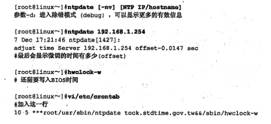

### Memcached

- [Memcached 协议中英文对照](http://www.lvtao.net/content/book/memcached.html)


### LVS

官网：http://www.linuxvirtualserver.org

中文站点：http://zh.linuxvirtualserver.org


**可伸缩网络服务的设计与实现**

来源： [http://zh.linuxvirtualserver.org/book/export/html/7](http://zh.linuxvirtualserver.org/book/export/html/7)

可伸缩/可扩展服务是指网络服务能随着用户数目的增长而扩展其性能，如在系统中增加服务器、内存或硬盘等；整个系统很容易扩展，无需重新设置整个系统，无需中断服务。换句话说，系统管理员扩展系统的操作对最终用户是透明的，他们不会知道系统的改变。

可伸缩系统通常是高可用的系统。在部分硬件（如硬盘、服务器、子网络）和部分软件（如操作系统、服务进程）的失效情况下，系统可以继续提供服务，最终用户不会感知到整个服务的中断，除了正在失效点上处理请求的部分用户可能会收到服务处理失败，需要重新提交请求。Caching和复制是建立高可用系统的常用技术，但建立多个副本会导致如何将原件的修改传播到多个副本上的问题。

实现可伸缩网络服务的方法一般是通过一对多的映射机制，将服务请求流分而治之（Divide and Conquer）到多个结点上处理。一对多的映射可以在很多层次上存在，如主机名上的DNS系统、网络曾的TCP/IP、文件系统等。虚拟（Virtual）是描述一对多映射机制的词汇，将多个实体组成一个逻辑上的、虚拟的整体。

------

*网络服务的需求* ：

- 可伸缩性（Scalability），当服务的负载增长时，系统能被扩展来满足需求，且不降低服务质量。
- 高可用性（Availability），尽管部分硬件和软件会发生故障，整个系统的服务必须是每天24小时每周7天可用的。
- 可管理性（Manageability），整个系统可能在物理上很大，但应该容易管理。
- 价格有效性（Cost-effectiveness）,整个系统实现是经济的、易支付的。

通过高性能网络或局域网互联的服务器集群正成为实现高可伸缩性的、高可用网络服务的有效结构。这种松耦合结构比紧耦合的多处理器系统具有更好的伸缩性和性能价格比，组成集群的PC服务器或RISC服务器和标准网络设备因为大规模生产，价格低，具有很高的性能价格比。

针对上述需求，提出基于IP层和基于内容请求分发的负载平衡调度解决方法，并在Linux内核中实现了这些方法，将一组服务器构成一个实现可伸缩的、高可用网络服务的服务器集群，我们称之为Linux虚拟服务器（Linux Virtual Server）。在LVS集群中，使得服务器集群的结构对客户是透明的，客户访问集群提供的网络服务就像访问一台高性能、高可用的服务器一样。客户程序不受服务器集群的影响不需作任何修改。系统的伸缩性通过在服务机群中透明地加入和删除一个节点来达到，通过检测节点或服务进程故障和正确地重置系统达到高可用性。

------

*LVS集群的通用结构*

LVS集群采用IP负载均衡技术和基于内容请求分发技术。调度器具有很好的吞吐率，将请求均衡地转移到不同的服务器上执行，且调度器能自动屏蔽掉服务器的故障，从而将一组服务器构成一个高性能、高可用的虚拟服务器。


如上图所示，可以看出LVS集群主要由3个部分构成：

- 负载调度器（load balancer），是整个集群对外面的前端机，负责将客户的请求发送到一组服务器上执行，而客户认为服务是来自一个IP上的。
- 服务器池（server pool），一组真正执行客户请求的服务器，执行的服务有WEB、MAIL、FTP和DNS等。
- 后端存储（backend storage），为服务器池提供一个共享的存储区，这样很容易使得服务器池拥有相同的内容，提供相同的服务。

调度器采用IP负载均衡技术、基于内容请求分发技术或者两者相结合。在IP负载均衡技术中，需要服务器池拥有相同的内容提供相同的服务。当客户请求到达时，调度器只根据负载情况从服务器池中选出一个服务器，将该请求转发到选出的服务器，并记录这个调度；当这个请求的其他报文到达，也会被转发到前面选出的服务器。在基于内容请求分发技术中，服务器可以提供不同的服务，当客户请求到达时，调度器可根据请求的内容和服务器的情况选择服务器执行请求。因为所有的操作都是在操作系统核心空间中将完成的，它的调度开销很小，所以它具有很高的吞吐率。

后端存储通常用容错的分布式文件系统，如AFS、GFS、Coda和Intermezzo等。分布式文件系统为各服务器提供共享的存储区，它们访问分布式文件系统就像访问本地文件系统一样。同时，分布式文件系统提供良好的伸缩性和可用性。然而，当不同服务器上的应用程序同时访问分布式文件系统上同一资源时，应用程序的访问冲突需要消解才能使得资源处于一致状态。这需要一个分布式锁管理器（Distributed Lock Manager），它可能是分布式文件系统内部提供的，也可能是外部的。

------

*高可用性*

集群系统的特点是它在软硬件上都有冗余。系统的高可用性可以通过检测节点或服务进程故障和正确地重置系统来实现，使得系统收到的请求能被存活的结点处理。通常，我们在调度器上有资源监视进程来时刻监视各个服务器结点的健康状况，当服务器对ICMP ping不可达时或者她的网络服务在指定的时间没有响应时，资源监视进程通知操作系统内核将该服务器从调度列表中删除或者失效。这样，新的服务请求就不会被调度到坏的结点。资源监测程序能通过电子邮件或传呼机向管理员报告故障，一旦监测到服务进程恢复工作，通知调度器将其加入调度列表进行调度。另外，通过系统提供的管理程序，管理员可发命令随时将一台机器加入服务或切出服务，很方便进行系统维护。

现在前端的调度器有可能成为系统的单一失效点。为了避免调度器失效导致整个系统不能工作，我们需要设立调度器的备份。两个心跳进程（Heartbeat Daemon）分别在主、从调度器上运行，它们通过串口线和UDP等心跳线来相互汇报各自的健康情况。当从调度器不能听得主调度器的心跳时，从调度器会接管主调度器的工作来提供负载调度服务。这里，一般通过ARP欺骗（Gratuitous ARP）（？）来接管集群的Virtual IP Address。当主调度器恢复时，这里有两种方法，一是主调度器自动变成从调度器，二是从调度器释放Virtual IP Address，主调度器收回Virtual IP Address并提供负载调度服务。然而，当主调度器故障后或者接管后，会导致已有的调度信息丢失，这需要客户程序重新发送请求。

------

*基于BGP的地理分布服务器集群调度*

BGP（Border Gateway Protocol）是用于自治系统（Autonomous Systems）之间交换路由信息的协议，BGP可以设置路由策略，如政策、安全和经济上的考虑。

我们可以利用BGP协议在Internet的BGP路由器插入到Virtual IP Address的路由信息。在不同区域的LVS集群向它附近的BGP路由器广播到Virtual IP Address的路由信息，这样就存在多条到Virtual IP Address的路径，Internet的BGP路由器会根据评价函数选出最近的一条路径。这样，我们可以使得用户访问离他们最近的LVS集群。当一个LVS集群系统失效时，它的路由信息自然不会在Internet的BGP路由器中交换，BGP路由器会选择其他到Virtual IP Address的路径。这样，可以做到抗灾害性（Disaster Tolerance）。


**IP负载均衡技术**

可伸缩网络服务一般都需要一个前端调度器。在调度器的实现技术中，IP负载均衡技术是效率最高的。在已有的IP负载均衡技术中有通过网络地址转换（Network Address Translation）将一组服务器构成一个高性能的、高可用的虚拟服务器，我们称之为VS/NAT技术（Virtual Server via Network Address Translation），大多数商品化的IP负载均衡调度器产品都是使用此方法，如Cisco的LocalDirector、F5的Big/IP和Alteon的ACEDirector。在分析VS/NAT的缺点和网络服务的非对称性的基础上，我们提出通过IP隧道实现虚拟服务器的方法VS/TUN（Virtual Server via IP Tunneling），和通过直接路由实现虚拟服务器的方法VS/DR（Virtual Server via Direct Routing），它们可以极大地提高系统的伸缩性。

------

*通过IP隧道实现虚拟服务器（VS/TUN）*

IP隧道（IP tunneling）是将一个IP报文封装在另一个IP报文的技术，这可以使得目标为一个IP地址的数据报文能被封装和转发到另一个IP地址。IP隧道技术亦称为IP封装技术（IP encapsulation）。IP隧道主要用于移动主机和虚拟私有网络（Virtual Private Network），在其中隧道都是静态建立的，隧道一端有一个IP地址，另一端也有唯一的IP地址。

我们利用IP隧道技术将请求报文封装转发给后端服务器，响应报文能从后端服务器直接返回给客户。但在这里，后端服务器有一组而非一个，所以我们不可能静态地建立一一对应的隧道，而是动态地选择一台服务器，将请求报文封装和转发给选出的服务器。这样，我们可以利用IP隧道的原理将一组服务器上的网络服务组成在一个IP地址上的虚拟网络服务。


VS/TUN的工作流程下图所示：它的连接调度和管理与VS/NAT中的一样，只是它的报文转发方法不同。调度器根据各个服务器的负载情况，动态地选择一台服务器，将请求报文封装在另一个IP报文中，再将封装后的IP报文转发给选出的服务器；服务器收到报文后，先将报文解封获得原来目标地址为VIP的报文，服务器发现VIP地址被配置在本地的IP隧道设备上，所以就处理这个请求，然后根据路由表将响应报文直接返回给客户。


------

*通过直接路由实现虚拟服务器（VS/DR）*

VS/DR的体系结构下图所示：调度器和服务器组都必须在物理上有一个网卡通过不分段的局域网相连，即通过交换机或者高速的HUB相连，中间没有隔有路由器。VIP地址为调度器和服务器组共享，调度器配置的VIP地址是对外可见的，用于接收虚拟服务的请求报文；所有的服务器把VIP地址配置在各自的Non-ARP网络设备上，它对外面是不可见的，只是用于处理目标地址为VIP的网络请求。


VS/DR的工作流程如下图所示：它的连接调度和管理与VS/NAT和VS/TUN中的一样，它的报文转发方法又有不同，将报文直接路由给目标服务器。在VS/DR中，调度器根据各个服务器的负载情况，动态地选择一台服务器，不修改也不封装IP报文，而是将数据帧的MAC地址改为选出服务器的MAC地址，再将修改后的数据帧在与服务器组的局域网上发送。因为数据帧的MAC地址是选出的服务器，所以服务器肯定可以收到这个数据帧，从中可以获得该IP报文。当服务器发现报文的目标地址VIP是在本地的网络设备上，服务器处理这个报文，然后根据路由表将响应报文直接返回给客户。


在VS/DR中，请求报文的目标地址为VIP，响应报文的源地址也为VIP，所以响应报文不需要作任何修改，可以直接返回给客户，客户认为得到正常的服务，而不会知道是哪一台服务器处理的。

VS/DR负载调度器也只处于从客户到服务器的半连接中，按照半连接的TCP有限状态机进行状态迁移。

------

### DNS/BIND

#### 编译安装BIND9.9.3

1. 从 [http://www.isc.org/downloads/](http://www.isc.org/downloads/) 下载BIND9.9.3-P2版本

2. ``tar -xvf bind-9.9.3-P2.tar.gz && cd bind-9.9.3-P2 && ./configure --preifx=/usr/local/bind9.9.3 --with-openssl=/usr/local/ssl && make && make install``

#### 配置BIND（缓存DNS）

编译安装好BIND后，默认并没有BIND的配置文件，需自己添加/usr/local/bind9.9.3/etc/named.conf（参考 [http://www.centos.bz/2012/02/bind-cacheing-only-dns-deploy](http://www.centos.bz/2012/02/bind-cacheing-only-dns-deploy/) ）

```
options {
    directory "/usr/local/bind9.9.3/etc/";
    forward only;
    forwarders {
	    8.8.8.8;
	    8.8.4.4;
    };
    allow-query {any;};
};
```

可使用 `/usr/local/bind9.9.3/sbin/named-checkconf` 来检测配置文件语法。

运行BIND： `/usr/local/bind9.9.3/sbin/named &`

查看端口占用： `netstat -tlnp` ，DNS服务器占用UDP(TCP)协议的53号端口。

BIND还提供了工具rndc来管理DNS服务器，命令工具为 `/usr/local/bind9.9.3/sbin/rndc` ，但rndc也需要配置，默认也没有配置文件，可使用sbin下的命令 `rndc-confgen` 来生成：

```shell
/usr/local/bind9.9.3/sbin/rndc-confgen -s 127.0.0.1 -r /dev/urandom > /usr/local/bind9.9.3/etc/rndc.conf
```

生成的配置内容为：

```
# Start of rndc.conf
key "rndc-key" {
    algorithm hmac-md5;
    secret "tahthw+V9UfRd0q8E63vPw==";
};

options {
    default-key "rndc-key";
    default-server 127.0.0.1;
    default-port 953;
};
# End of rndc.conf

# Use with the following in named.conf, adjusting the allow list as needed:
# key "rndc-key" {
# 	algorithm hmac-md5;
# 	secret "tahthw+V9UfRd0q8E63vPw==";
# };
# 
# controls {
# 	inet 127.0.0.1 port 953
# 		allow { 127.0.0.1; } keys { "rndc-key"; };
# };
# End of named.conf
```
    
根据注释部分的内容，应在 `named.conf` 的最后添加：

```
key "rndc-key" {
    algorithm hmac-md5;
    secret "tahthw+V9UfRd0q8E63vPw==";
};

controls {
    inet 127.0.0.1 port 953
	    allow { 127.0.0.1;} keys { "rndc-key"; };
};
```
    
重启named，然后就可以使用 `rndc` 命令来管理DNS服务器了：

```
/usr/local/bind9.9.3/sbin/rndc status
/usr/local/bind9.9.3/sbin/rndc stats    # 这条命令会将结果放入/usr/local/bind9.9.3/etc/named.stats中
/usr/local/bind9.9.3/sbin/rndc dumpdb   # 这条命令会将结果放入/usr/local/bind9.9.3/etc/named_dump.db中
```

更详细使用查看帮助 `/usr/local/bind9.9.3/sbin/rndc --help`

#### 推荐资料

- [鸟哥的私房菜---第十九章、主机名控制者：DNS服务器](http://vbird.dic.ksu.edu.tw/linux_server/0350dns_1.php)
- [第二十二章 DNS服务器](http://man.ddvip.com/os/freebsd_book_chs/ch22.htm)
- TCP/IP详解（卷一）第14章 DNS:域名系统
- [Wikipedia-Domain Name System](http://en.wikipedia.org/wiki/Domain_Name_System)
- [bind使用rndc](http://xjsunjie.blog.51cto.com/999372/379245)
- [配置域从DNS服务器以及缓存DNS服务器](http://www.cnblogs.com/xiaoluo501395377/archive/2013/06/07/3123079.html)

------

### Keepalived

官网：http://www.keepalived.org

主要功能是实现真实机的故障隔离及负载均衡器间的失败切换（failover）。负载均衡器之间的失败切换，是通过VRRPv2（Virtual Router Redundancy Protocol）stack实现的，VRRP当初被设计出来的目的就是为了解决静态路由器的单点故障问题。

iptables的启用是不会影响Keepalived的运行的，但为了更好的性能，通常会将整套系统内所有主机的iptables都停用。

Keepalived产生的VIP就是整个系统对外的IP，如果最外端的防火墙采用的是路由模式，那就映射此内网IP为公网IP。

#### tlinux上源码编译安装Keepalived

Keepalived依赖于OpenSSL、popt，所以先编译安装这两者：

- OpenSSL
  
  - ``wget http://www.openssl.org/source/openssl-1.0.1e.tar.gz`` 
  - ``tar -xvf openssl-1.0.1e.tar.gz``
  - ``cd openssl-1.0.1e && ./config --prefix=/usr/local/openssl && make && make install``

- popt

  - ``wget http://rpm5.org/files/popt/popt-1.14.tar.gz``
  - ``tar -xvf popt-1.14.tar.gz``
  - ``cd popt-1.14 && ./configure && make && make install``

然后安装Keepalived：

- ``wget http://www.keepalived.org/software/keepalived-1.2.7.tar.gz``
- ``tar -xvf keepalived-1.2.7.tar.gz``
- ``cd keepalived-1.2.7 && ./configure --prefix=/usr/local/keepalived && make && make install``

一般情况下，这样就能成功安装了，但tlinux上这样并不行，configure的过程应为：

- ``LDFLAGS=-ldl CFLAGS="-I/usr/local/openssl/include  -L/usr/local/openssl/lib  -L/usr/local/lib" ./configure --prefix=/usr/local/keepalived``

- ``export LIBRARY_PATH=$LIBRARY_PATH:/usr/local/openssl/lib``

然后 ``make && make install`` 就可以了。

#### VRRP协议

VRRP协议是为了消除在静态缺省路由环境下的缺省路由器单点故障引起的网络失效而设计的主备模式的协议，使得在发生故障而进行设备功能切换时可以不影响内外数据通信，不需要再修改内部网络的网络参数。

VRRP协议将两台或多台路由器设备虚拟成一个设备，对外提供虚拟路由器IP（一个或多个），而在路由器内部，如果实际拥有这个对外IP的路由器工作正常的话就是MASTER，或者通常算法选举产生，MASTER实现针对虚拟路由器IP的各种网络功能，如ARP请求、ICMP、以及数据的转发等；其他设备不拥有该IP，状态为BACKUP，除了接收MASTER的VRRP状态通告信息外，不执行对外的网络功能。当MASTER主机失效时，BACKUP将接管原先MASTER的网络功能。

#### Keepalived原理

Keepalived是模块化设计的，不同模块负责不同的功能，下面是Keepalived的组件：

**core check vrrp libipfwc libipvs-2.4 libipvs-2.6**

- core：是keepalived的核心，负责主进程的启动和维护，全局配置文件的加载解析等
- check：负责healthchecker（健康检查），包括各种健康检查方式，以及对应的配置的解析包括LVS的配置解析
- vrrp：VRRPD子进程，VRRPD子进程就是来实现VRRP协议的
- libipfwc：iptables（ipchains）库，配置LVS会用到（注：现在已经没有该模块了）
- libipvs*：配置LVS会用到

*注：keepalived和LVS完全是两码事，只不过它们各负其责相互配合而已*

#### 参考资料

- [VRRP协议介绍](http://bbs.ywlm.net/thread-790-1-1.html)
- [Keepalived原理与实战精讲](http://bbs.ywlm.net/thread-845-1-1.html)
- [VRRP故障处理手册](http://www.h3c.com.cn/Products___Technology/Technology/Dependability/Other_technology/Malfunction_manage_enchiridion/200803/600642_30003_0.htm#_Toc189477082)

------

### NTP

[鸟哥的私房菜 - NTP服务器的安装与设定](http://vbird.dic.ksu.edu.tw/linux_server/0440ntp_2.php)

安装NTP服务，其实就是将NTP安装好后，规定一部上层NTP服务器来同步化你的时间即可！如果你只是想要进行你自己单部主机的时间同步化，别架设NTP，直接使用NTP客户端软件即可。

与时间及 NTP 服务器设定相关的配置文件与重要数据文件有如下几个：

-   **/etc/ntp.conf** : NTP服务器的主要配置文件，也是唯一的一个；
-   **/usr/share/zoneinfo/** : 由tzdata提供，为各时区的时间格式对应文件；
-   **/etc/sysconfig/clock** : 设定时区与是否使用 UTC 时间钟的配置文件。 每次开机后Linux会自动的读取这个文件来设定自己系统所默认要显示的时间；
-   **/etc/localtime** : 这个文件就是“本地端的时间配置文件”啦！刚刚那个clock文件里面规定了使用的时间配置文件(ZONE)为/usr/share/zoneinfo/Asia/Taipei，所以说这就是本地端的时间了，此时Linux系统就会将Taipei那个文件复制一份成为/etc/localtime ，所以未来我们的时间显示就会以Taipei那个时间配置文件为准。

常用于时间服务器与修改时间的命令，主要有如下几个：

-   **/bin/date** : 用于 Linux 时间 (软件时钟) 的修改与显示的指令；
-   **/sbin/hwclock** : 用于 BIOS 时钟 (硬件时钟) 的修改与显示的指令。 这是一个root才能执行的指令，因为Linux系统上面BIOS时间与Linux系统时间是分开的，所以使用date这个指令调整了时间之后，还需要使用hwclock才能将修改过后的时间写入 BIOS 当中！
-   **/usr/sbin/ntpd** : 主要提供 NTP 服务的程序，配置文件为 /etc/ntp.conf
-   **/usr/sbin/ntpdate** : 用于客户端的时间校正，如果你没有要启用 NTP 而仅想要使用NTP Client功能的话，那么只会用到这个指令而已啦！

#### 配置文件ntp.conf

**利用restrict来管理权限控制**

```
restrict [你的IP] mask [netmask_IP] [parameter]
```

其中parameter的值有如下几种：

- ignore：拒绝所有类型的NTP联机
- nomodify：客户端不能使用ntpc与ntpq这两个程序来修改服务器的时间参数，但客户端仍可透过这部主机来进行网络校时
- noquery：客户端不能使用ntpq、ntpc等命令来查询时间服务器，等于不提供NTP的网络校时
- notrap：不提供trap这个远程事件记录（remote event logging）的功能
- notrust：拒绝没有认证的客户端

如果你没有在parameter的地方加上任何参数的话，这表示 **该 IP 或网段不受任何限制** 的意思。一般来说，我们可以先关闭NTP的权限，然后再一个一个的启用允许登入的网段。

**利用server设定上层NTP服务器**

```
server [IP or hostname] [prefer]
```


在server后可以接IP或主机名，鸟哥个人比较喜欢使用IP来设定。至于那个perfer表示“优先使用”的服务器。

**以driftfile记录时间差异**

```
driftfile [可以被ntpd写入的目录与文件]
```


因为默认的NTP Server本身的时间计算是依据BIOS的芯片震荡周期频率来计算的，但是这个数值与上层Time Server不见得会一致，所以NTP这个daemon(ntpd)会自动的去计算我们自己主机的频率与上层Time server的频率，并且将两个频率的误差记录下来，记录下来的内容就是在driftfile后面接的绝对路径文件当中。关于该文件的文件名，需注意：

- driftfile后面接的文件需要使用完整路径的文件名；
- 该文件不能是链接文件
- 该文件需要设置成ntpd这个daemon可以写入的权限
- 该文件锁记录的数值单位为百万分直译秒（ppm）

driftfile后面接的文件会被ntpd自动更新，所以它的权限一定要能够让ntpd写入才行。

**keys[key_file]**

除了以restrict来限制客户端的联机之外，也可以通过密钥来给客户端认证。

#### 客户端的时间更新方式

**Linux系统时间与硬件时间**

在Linux操作系统中有两个时间：

- 一个是BIOS记录的实际时间，这也是硬件所记录的
- 一个是Linux自己的系统时间，由1970/01/01开始记录的时间参数

当Linux开机后，它会主动的读出BIOS所记录的时间，然后开始用自己的方式计算时间。当我们使用date之类的指令来查询或设置时间时，该时间指的是Linux的时间而已，并没有改变BIOS内所记录的时间。除非你使用hwclock来写入或读出BIOS的时间。

由于BIOS会记录时间而且会持续计时，因为我们关机后再开机时，会发现BIOS时间一直在累加。为了维持BIOS所记录的信息，主板上面的电池就很重要，它可以让BIOS在关机的时候还记录的记录硬件信息以及计时。所以如果你发现开机后整个BIOS时间恢复成为系统出厂值，很可能就是主板上的电池没电了。如果你将BIOS断电处理，时间也会恢复成为系统出厂值。

由于每个BIOS内部的时间计算器会有误差，因为与Linux时间就会产生差异，这个差异在时间长了之后，会越来越大。所以需要进行网络校时。

**Linux系统时区与手动校时工作**

Linux的时区文件是/etc/localtime，这是一个时间格式的文件，而不是ASCII类型的文件。至于所有的Time Zone则放置在/usr/share/Zoneinfo目录下。注意：

- 当/etc/localtime存在时，系统的时区以该文件代表的时区来显示
- 当/etc/localtime不存在时，系统的时区主要以GMT（或UTC）为准

所以，如果你想要变更Linux系统的时区，那么只要在/usr/share/Zoneinfo里找到你需要的时区文件，将它另存为/etc/localtime，就可以顺利地更新时区设置了。另外，同时建议修正一下/etc/sysconfig/clock这个文件里的ZONE设置值。以中国台湾地区的Time Zone为例，在/etc/sysconfig/clock这个文件中应该是“ZONE="Asia/Taipei"”，这表示我们的时区文件为/usr/share/Zoneinfo/Asia/Taipei，请对应修改成你想要的时区。

可以通过date指令来手动修正目前主机的时间，不过，date指令仅修正Linux时间而已，还需要通过hwclock指令（ ``hwclock -w`` ）来更新BIOS时间。

**Linux的网络校时**

在Linux的环境中可利用NTP的客户端程序，即ntpdate程序进行时间同步。因为NTP服务器本来就会与上层时间服务器进行时间同步，所以在默认情况下，NTP服务器不可以使用ntpdate，也就是说ntpdate与ntpd不能同时启用。



------

### OpenVPN

官网：http://openvpn.net/


**如何让客户端流量全部走VPN？**

见HOWTO文档的“Routing all client traffic (including web-traffic) through the VPN”部分。

主要是在VPN服务器端配置文件（如：/etc/openvpn/server.conf）添加如下一条指令：

```
push "redirect-gateway def1"
```

如果VPN服务建立无线网络之上（所有客户端与服务器在同一个无线子网中），则还需添加一个 ``local`` 标记：

```
push "redirect-gateway local def1"
```

该指令的作用其实是在VPN客户端连接到VPN服务器时，服务器将push指令的内容推送到客户端中，其内容会修改客户端本地的路由表。

另外，既然push指令是将其内容推送到客户端生效，并不是对服务器本身生效，那么可以将push指令的内容直接写在客户端配置文件中，如在OpenVPN客户端安装目录的config子目录下有个“.ovpn”后缀的文件，
在该文件中添加：

```
redirect-gateway def1
```

换个角度，如果不想让客户端流量全部走VPN，则需确保OpenVPN服务器端配置文件中没有 ``push "redirect-gateway def1"`` ，并且客户端配置文件中也没有 ``redirect-gateway def1`` 。


#### 参考资料

- [OpenVPN HOWTO](http://openvpn.net/index.php/open-source/documentation/howto.html)
