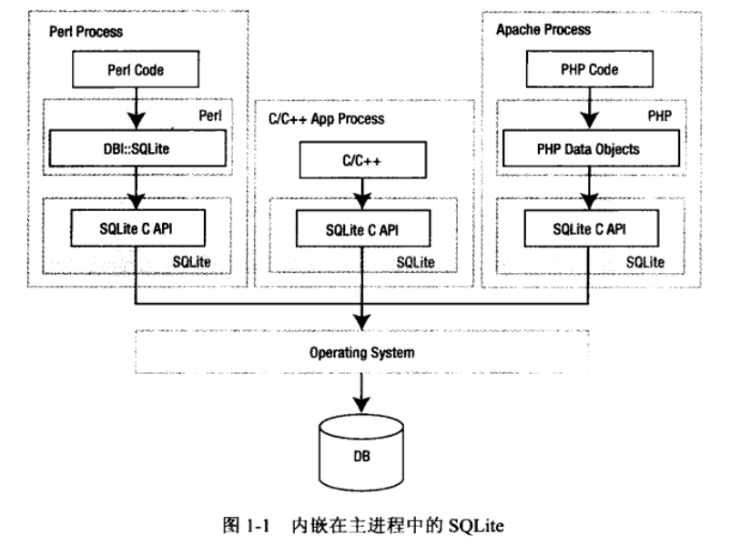
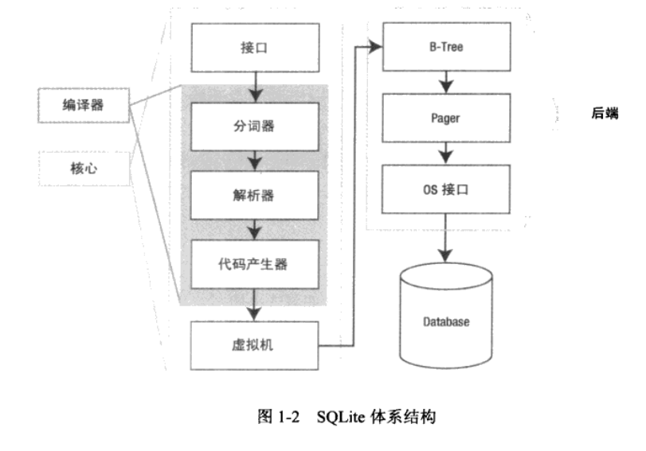
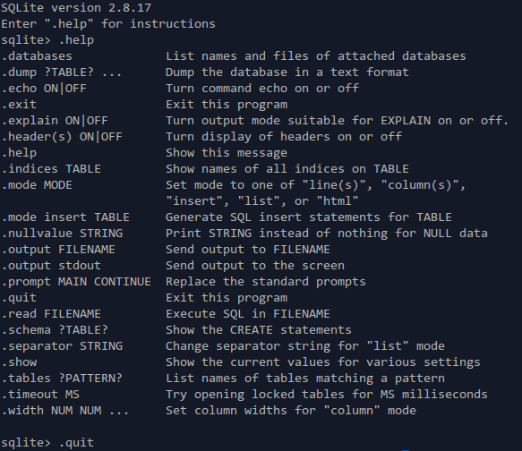
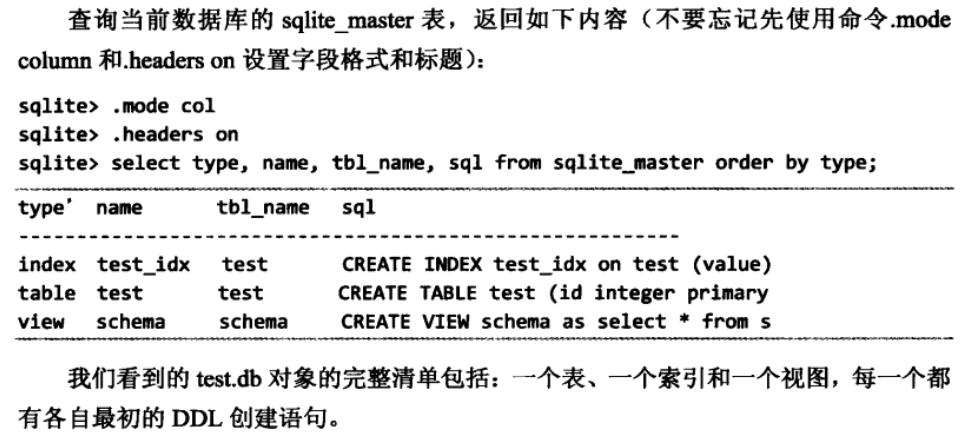
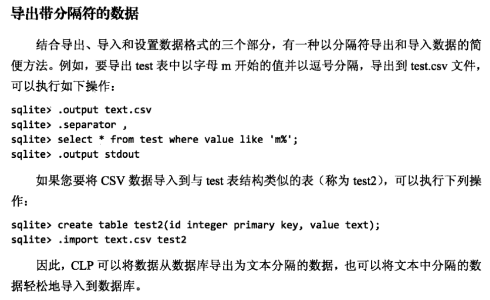
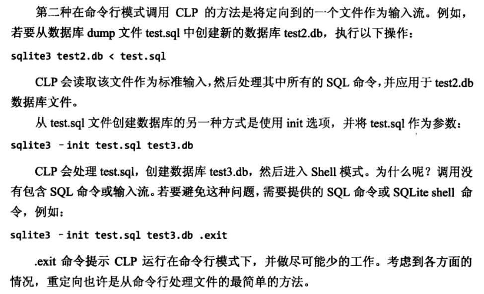
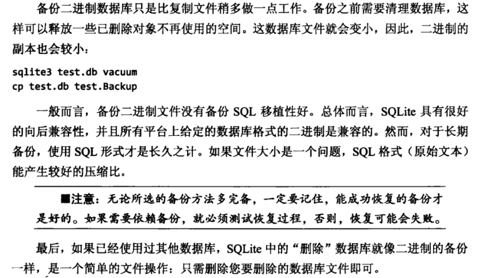

## SQLite

### 《SQLite权威指南》阅读笔记



#### 体系结构

SQLite拥有一个简洁的、模块化的体系结构，并引进了一些独特的方法进行关系型数据库管理。
它由可以划分为3个子系统的8个独立模块进行。如下图所示，这些模块将查询过程划分为几
个独立的任务，在体系结构栈的顶部编译查询语句，在中部执行，在底部处理存储并与操作
系统交互。



**接口**

接口处于栈的顶端，由SQLite C
API组成。程序、脚本语言还有与SQLite交互的库文件最终都是通过它与SQLite交互的。

**编译器**

编译过程从词法分析器（Tokenizer）和语法分析器（Parser）开始。它们协同处理文本形式
的结构化查询语言（SQL），分析其语法有效性，然后转化为底层能更方便地处理的层次化
数据结构。SQL语句先被分解成一个个词法记号，经过评估后以语法树形式重组，然后语法分析器
将该树下传给代码生成器。

代码生成器将语法树翻译成一种SQLite专用的汇编代码，这些汇编代码由一些最终由虚拟机执行
的指令组成。代码生成器的唯一工作是将语法树转换为完全由这种汇编语言编写的微程序并交给虚拟机处理。

**虚拟机**

体系结构栈的中心部分是虚拟机，也叫虚拟数据库引擎（Virtual Database Engine，VDBE）。

#### SQLite的特性

SQLite的冲突解决功能内建在许多SQL操作中，可以用来执行称为“惰性更新”的操作。假设有
一个记录需要插入，但是您不确定数据库中是否已经存在一个了。可以不用先写SELECT语句去
查询，如果存在，就将您的INSERT语句重新改写成UPDATE语句，冲突解决可以帮助您。“试图
插入该记录，如果发现相同主键的记录，就更新该记录”。现在就可以将必须写三个不同的SQL
语句（例如，SELECT、INSERT，以及可能的UPDATE）转换成一个INSERT ON
REPLACE(...)语句。

SQLite可以将外部数据库“附着”到当前连接中。假如你当前连接到一个数据库foo.db，同时
需要另外一个数据库bar.db工作。不用打开一个单独的连接，然后在它们之间来回切换，可以
简单地将感兴趣的数据库用下面的一个SQL语句附着到当前连接：

```ATTACH database bar.db as bar;```

bar.db中所有的表现在读可以访问了，就好像它们存在于foo.db中一样，完成时也可以剥离。
这使得在数据库之间的各种操作如同复制表一样容易。

#### 性能和限制

在对单表进行查询时，平均而言，SQLite与其他数据库一样快（至少不慢于）。简单的SELECT、
INSERT和UPDATE语句是相当快速的---几乎与内存（如果是内存数据库）或者磁盘同速。SQLite
通常要快于其他数据库，因为它在处理一个事务开始，或者一个查询计划的产生方面开销较小，
并且没有调用服务器的网络或认证以及权限协商的开销。它的简单性使它更快。

但是随着查询变大变复杂，查询时间使得网络调用或者事务处理开销相形见绌，SQLite将会与
其他数据库一样，这时一些大型的设计复杂的数据库开始发挥作用。虽然SQLite也能处理复杂的
查询，但是它没有精密的优化器或者查询计划器。SQLite知道如何使用索引，但是它没有保存
详细的表统计信息。

假如你在大型数据集合上运行复杂的查询，SQLite与那些有复杂设计的查询计划器的数据库
运行一样快的机会是非常小的。

一些情况下，SQLite可能不如大型数据库快，但大多数的这些情况是可预期的。SQLite是为
中小规模的应用程序设计的一个嵌入式的数据库，这些限制是设计目的可预见到的。许多新
用于错误地认为使用SQLite可以代替大型关系型数据库。事实是有时可以这样做，有时不行，
这完全取决于您准备用SQLite来做什么。

一般情况下，SQLite的局限性主要有以下两方面：

- 并发：
  SQLite的锁机制是粗粒度的，它允许多个读，但是一次只允许一个写。写锁会在写期间排他
  地锁定数据库。通常情况下，SQLite中的锁只保持几毫秒。但是按照一般经验，如果你的应用
  程序有很高的写并发（许多连接竞争向同一数据库写），并且是时间关键型，你可能需要其他
  数据库。

- 网络：
  虽然SQLite数据库可以通过网络文件系统共享，但是与这种文件系统相关的潜在延时会导致
  性能受损。更糟的是，网络文件系统实现中的一些缺陷也使得打开和修改远程文件---SQLite
  或其他---很容易出错。


尽管SQLite的实现已经相当好了，但仍有部分特性未能实现，这些特性有：

- 完整的触发器支持。

- 完整的修改表结构支持。
  目前只支持RENAME TABLE和ADD COLUMN类型的ALTER TABLE命令。其他类型的ALTER TABLE
  操作，例如DROP COLUMN、ALTER COLUMN以及ADD CONSTRAINT还未实现。

- 右外连接与全外连接。

- 可更新的视图。

- 窗口功能。

- 授权和撤销。


根据不同的使用方式，SQLite有以下几种形式的二进制程序包可供选择：

- sqlite3命令行程序（CLP）：
  该版本的SQLite命令行程序通过静态链接将数据库引擎编译
  在内，是自我包含的独立的程序。它提供了一种便捷的通过命令行与SQLite数据库一起工作
  的方式。

- SQLite共享库（DLL或者“so”）：
  共享库就是将SQLite数据库引擎打包进共享库（so），或者Windows动态链接库（DLL）。

- SQLite Analyzer：
  分析工具可以用来检查给定SQLite数据库文件的特性和统计信息，例如，文件中的物理数据
  分布和布局、相对碎片、内部数据大小和空闲空间以及其他内容。

- Tcl扩展：
  二进制版本在SQLite
  core中包含了Tcl语言扩展，这样你就可以从Tcl程序连接到SQLite。


**SQLite命令行程序的使用**






**导出数据**

使用 ``.dump`` 命令可以将数据库对象导出成SQL格式。不带任何参数时， ``.dump``
将整个数据库导出为数据库定义语句（DDL）和数据操作语句（DML）（这些命令会被写入文本或在标准输出上显示），
适合重新创建数据库对象和其中的数据。如果提供了参数，Shell将参数解析为表名或视图，导出任何匹配给定参数
的表或视图，那些不匹配的将被忽略。在Shell模式中，默认情况下， ``.dump``
命令的输出定向到屏幕。如果你要将输出重定向到文件，请使用 ``.dump [filename]``
命令，此命令将所有的输出重定向到指定的文件中。若要恢复输出到屏幕，只需执行
``.output stdout`` 。因此，要将当前数据库导出到文件file.sql，可以输入如下命令：

```
sqlite> .output file.sql
sqlite> .dump
sqlite> .output stdout
```


**导入数据**

有两种方法可以导入数据，用哪种方法取决于要导入的文件格式。如果文件由SQL语句构成，可以使用
``.read``
命令导入（执行）文件中包含的命令。如果文件包含由逗号或其他分隔符分隔的值（comma-separated
values, CSV）组成，可使用 ``.import [file] [table]``
命令，此命令将解析指定的文件并尝试将数据插入到指定的表中。

``.read`` 命令用来导入 ``.dump``
命令创建的文件。如果使用前面作为备份文件所导出的file.sql，需要先移除已经存在的数据库对象（test表和schema视图），
然后导入：

```
sqlite> drop table test;
sqlite> drop view schema;
sqlite> .read file.sql
```










**获取数据库文件的信息**

获取逻辑数据库的信息（例如，表名、DDL语句等）的主要方法是使用sqlite_master视图，该
视图提供有关给定数据库包含的所有对象的详细信息。

如果希望了解物理数据库结构的信息，可以使用一种称为SQLite
Analyzer的工具，可以从SQLite网站下载该工具的二进制包。SQLite
Analyzer提供有关SQLite数据库磁盘结构的详细技术信息，这些信息包括数据库、表和索引分类的单个对象，
以及聚合的统计信息。它提供从数据库属性如页面大小、表的总数、索引、文件大小和页面平均密度（利用率）
到单个数据库对象的详细说明等信息。
